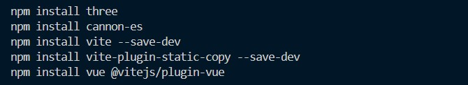
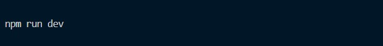
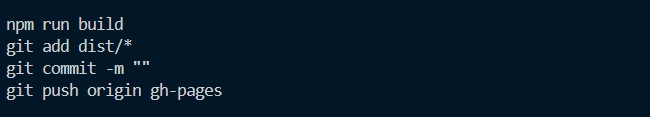

# NP Overflow Open House
View project live [here](https://razorbird360.github.io/NP-Overflow-Open-House/)

## Project Description
An interactive 3d website made using Three.js, to show a portfolio-ish website that will showcase some of overflows projects and what it is about, to introduce others to what overflow is about at the open house, will making it a fun experience. There will be a main character which will be able to move around a landscape 

---

### Install Libraries
  
Install Three.js, Cannon-es, Vite, Vue for project environment & vite plugin to compile Vue files

---

### Run project locally
  
Alternatively, "npx vite" to run project, but it does not guarantee consistency with locally installed versions

---

### Update project development pages
  
To update github pages